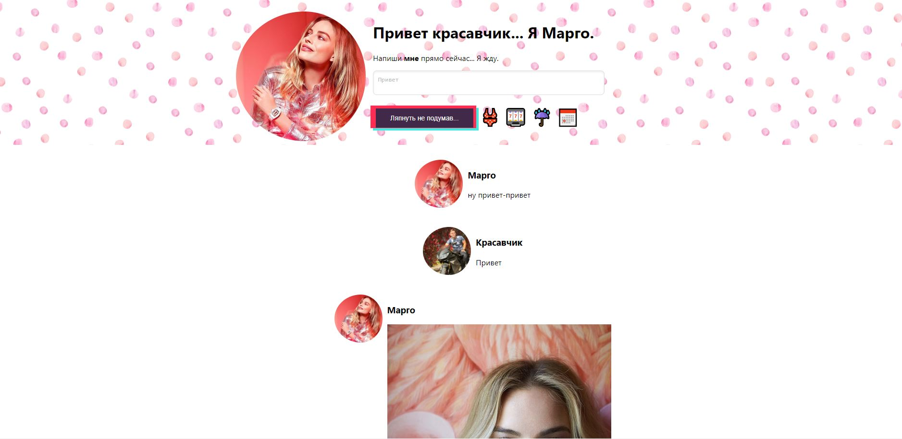

# Margot Robbie - artificial girlfriend project :heart_eyes: 
Margot Robbie is an artificial intelligence (based on scripts) that allow you to talk with, get weather predictions, current time, random number and some photoes. :dancer:

To start whole project:
1. maven -> install
2. cd target
3. java -jar girlfriend-0.0.1-SNAPSHOT.jar (or bootstrap in IDEA)

To start front-end:
1. cd front-end
2. npm install
3. npm start

Enjoy conversation, geek! :zany_face: :smirk: :neckbeard: